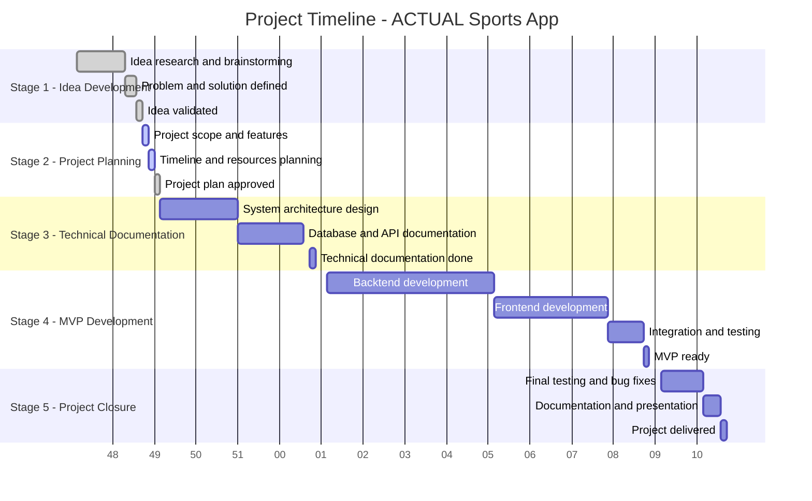

# Stage 2: Project Planning

| Stage                                | Milestone / Deliverable                  | Start Date | Delivery Date |
| ------------------------------------ | ---------------------------------------- | ---------- | ------------- |
| **Stage 1: Idea Development**        | Idea research and brainstorming document | 2025-12-01 | 2025-12-08    |
|                                      | Problem and solution definition document | 2025-12-09 | 2025-12-10    |
|                                      | Idea validation / Proof of concept       | 2025-12-11 | 2025-12-11    |
| **Stage 2: Project Planning**        | Project scope and feature list           | 2025-12-12 | 2025-12-12    |
|                                      | Timeline and resources planning document | 2025-12-13 | 2025-12-13    |
|                                      | Project plan approved                    | 2025-12-14 | 2025-12-14    |
| **Stage 3: Technical Documentation** | System architecture design               | 2025-12-15 | 2025-12-28    |
|                                      | Database and API documentation           | 2025-12-29 | 2026-01-08    |
|                                      | Complete technical documentation         | 2026-01-09 | 2026-01-09    |
| **Stage 4: MVP Development**         | Backend development                      | 2026-01-12 | 2026-02-08    |
|                                      | Frontend development                     | 2026-02-09 | 2026-02-27    |
|                                      | Integration and testing                  | 2026-02-28 | 2026-03-05    |
|                                      | MVP ready                                | 2026-03-06 | 2026-03-06    |
| **Stage 5: Project Closure**         | Final testing and bug fixes              | 2026-03-09 | 2026-03-16    |
|                                      | Documentation and presentation           | 2026-03-17 | 2026-03-19    |
|                                      | Project delivered                        | 2026-03-19 | 2026-03-19    |

