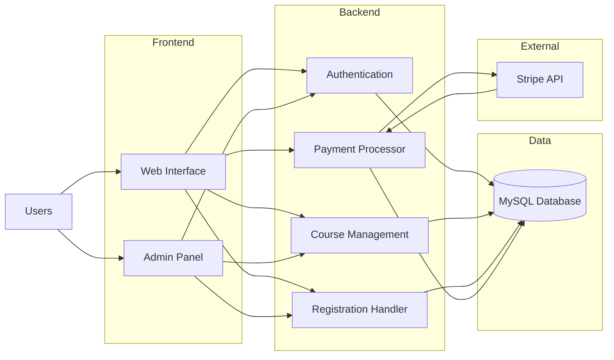
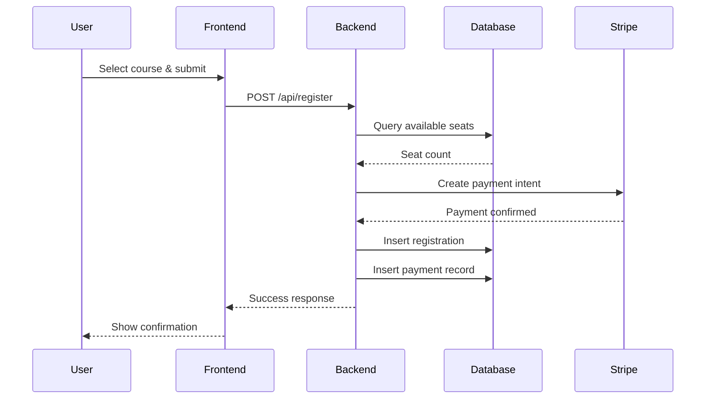
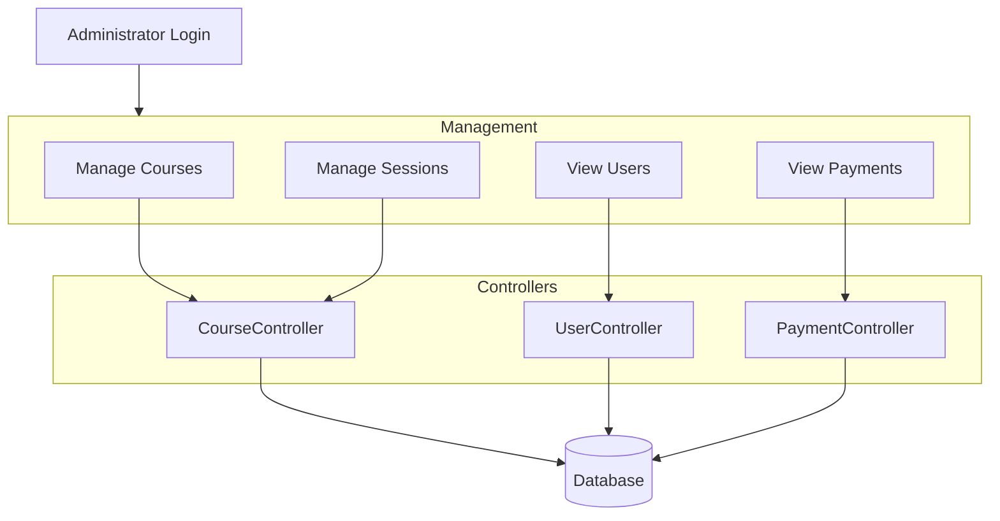
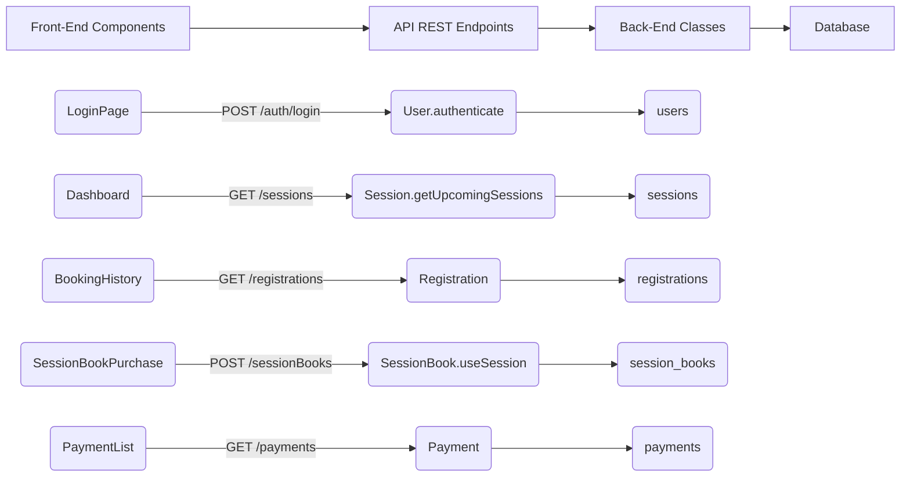
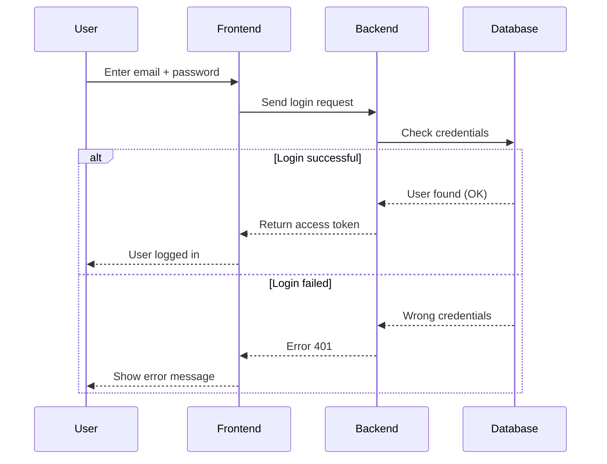
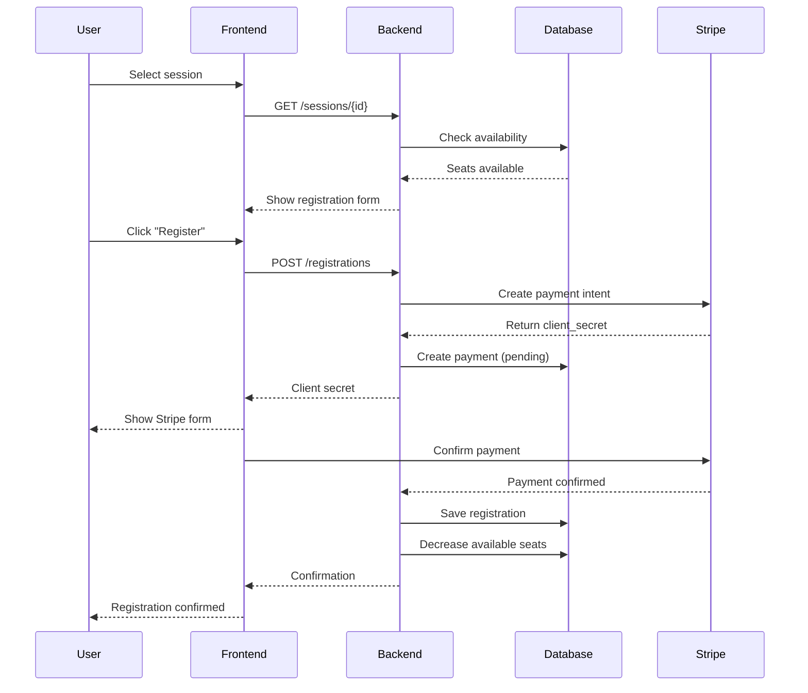
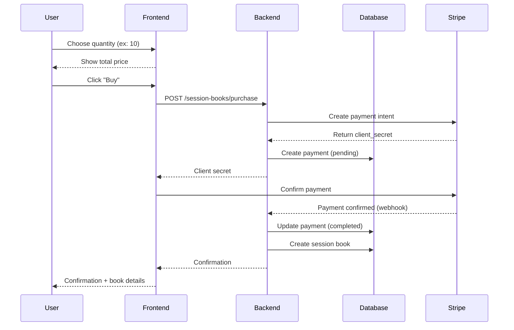
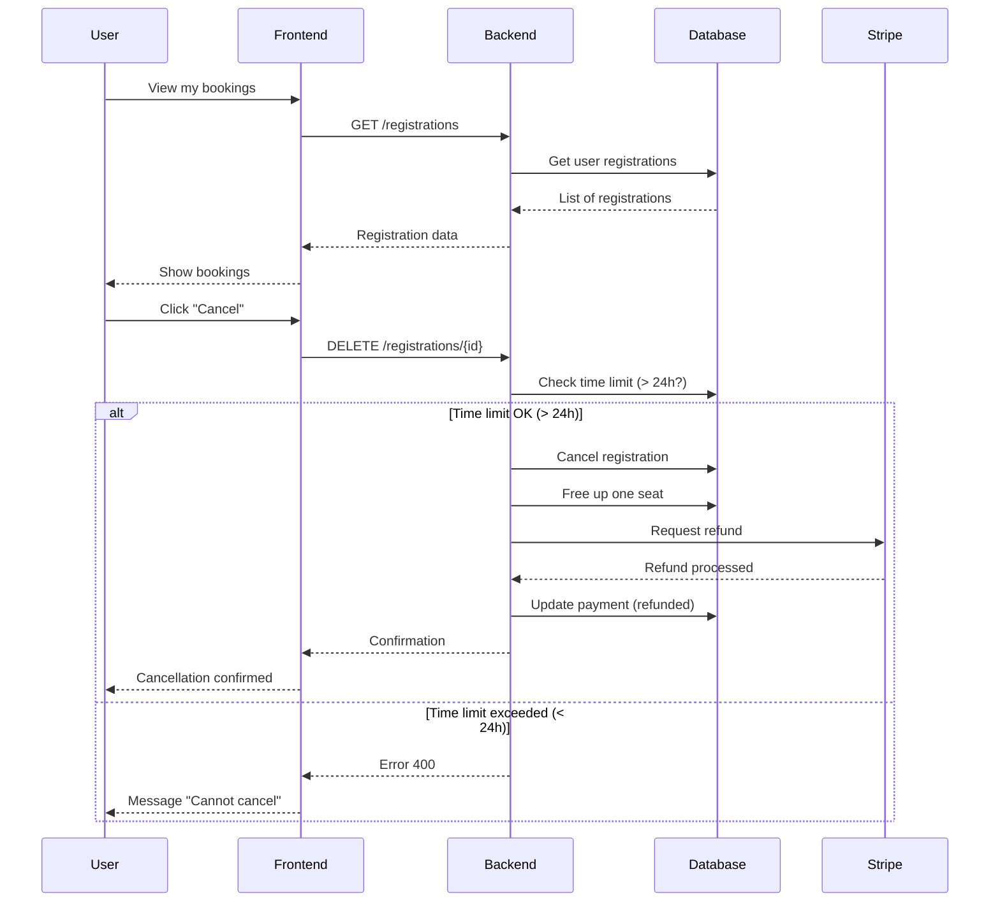

Table des matières

User Stories and Mockups

0.1 User Stories

0.2 Mockups

Design System Architecture

1.1 Project Overview

1.2 System Architecture Diagram

1.3 Data Flow Process

1.4 Database Structure

1.5 Backend Services

1.6 Administrator Workflow

1.7 Scalability Considerations

1.8 Security Measures

1.9 Future Development

Components, Classes, and Database Design

2.1 Back-End – Main Classes

2.2 Front-End – UI Components

High-Level Sequence Diagrams

3.1 User Login

3.2 Register for a Session

3.3 Purchase a Session Book

3.4 Cancel a Registration

Document External and Internal APIs

4.1 External APIs

4.2 Internal API (REST API)

SCM & QA Strategy

5.1 Source Control Management

5.2 Quality Assurance

5.3 Deployment Pipeline

# 0 - User Stories and Mockups

## 0.1 - **User Stories**
| User Story                                                                                                                                                    | MoSCoW      |
| ------------------------------------------------------------------------------------------------------------------------------------------------------------- | ----------- |
| As a user, I want to create an account and log in, so that I can access my registrations and bookings.                                                        | Must Have   |
| As a user, I want to view the schedule of available courses, so that I can choose which one to register for.                                                  | Must Have   |
| As a user, I want to register for a course and pay online, so that I can easily reserve my spot.                                                              | Must Have   |
| As a user, I want to purchase a **session book** (package of sessions), so that I can manage multiple sessions at once.                                       | Must Have   |
| As a user, I want to view my booking and payment history, so that I can track my activities and transactions.                                                 | Should Have |
| As a user, I want to cancel a registration within the allowed timeframe, so that I can get a refund or credit.                                                | Must Have   |
| As an administrator, I want to create, edit, and delete courses, so that I can manage the facility’s offerings.                                               | Must Have   |
| As an administrator, I want to manage sessions (dates, available seats, prices), so that I can organize the schedule.                                         | Must Have   |
| As an administrator, I want to view the list of users, payments, and registrations, so that I can supervise the system.                                       | Must Have   |
| As a user, I want a clear dashboard with my session balance, upcoming registrations, and quick access to actions, so that I can navigate easily.              | Should Have |
| As a user, I want the site to be responsive, so that I can register from mobile or tablet.                                                                    | Must Have   |
| As a user, I want to receive confirmation messages after each action (registration, payment, cancellation), so that I know if the action succeeded or failed. | Must Have   |
| As an administrator, I want statistics and reports (sessions, registrations, revenue), so that I can optimize facility management.                            | Could Have  |
| As a user, I want an internal messaging system to communicate with instructors, so that I can ask questions directly.                                         | Won’t Have  |
| As a user, I want a native mobile application (iOS/Android) at launch.                                                                                        | Won’t Have  |
| As a user, I want push notifications for every event.                                                                                                         | Won’t Have  |

🔝 Retour en haut

## 0.2 - **Mockups**

**Mockup link:**  
[Figma - Projet Portfolio Actual](https://www.figma.com/proto/n2tV15vPVSQ17N4QGYopwz/projet-portfolio-actual?node-id=1-3&p=f&t=LhLh9Zgk2Hqk3xHb-0&scaling=min-zoom&content-scaling=fixed&page-id=0%3A1)

**Summary of main screens:**

- **Login / Register Page**: account creation and login with email and password, including field validation.
    
- **User Dashboard / Course Planning**: session balance, upcoming course schedule, quick access to bookings and session book purchases.
    
- **Session Detail**: course details, registration form, and payment via Stripe.
    
- **Booking History**: list of past and upcoming bookings, with option to cancel if conditions are met.
    
- **Session Book Purchase**: select package, total price, secure payment with confirmation.
    
- **Admin Dashboard**: statistics, course and session management, user and payment monitoring.
    
- **Forms (Create/Edit Course / Session)**: CRUD management with validation.
    
- **UI Components**: Header, Footer, FlashMessages, ConfirmDialog, DatePicker, PriceDisplay, SessionCard, LoadingSpinner.

# ### 1. Design System Architecture

## 1.1- Project Overview

This document describes the architecture for a sports facility management application. The system handles course scheduling, user registrations, online payments, and administrative operations.

🔝 Retour en haut

## Architecture Components

### Front-end Layer
- HTML/CSS for structure and styling
- Twig templating engine integrated with Symfony
- Responsive user interface for course browsing and registration
- Administrative dashboard for facility management

### Back-end Layer
- PHP with Symfony framework
- MVC architecture pattern
- RESTful API endpoints
- Business logic processing
- Authentication and authorization handling

### Data Layer
- MySQL relational database
- Doctrine ORM for database abstraction
- Entity relationships for users, courses, sessions, and payments

### External Services
- Stripe payment gateway integration
- Webhook(notify when an event occurs) handling for payment confirmations

## Technology Stack

**Frontend**: HTML, CSS, Twig
**Backend**: PHP, Symfony
**Database**: MySQL
**Payments**: Stripe API

🔝 Retour en haut

## 1.2 - System Architecture Diagram



🔝 Retour en haut

## 1.3 - Data Flow Process

Registration and payment workflow:

1. User selects a course from the schedule
2. Form submission triggers frontend validation
3. HTTP POST request sent to backend API
4. Backend checks session availability in database
5. If seats available, payment request sent to Stripe
6. Stripe processes payment and returns status
7. Backend updates database with registration and payment records
8. Success response returned to frontend
9. User receives confirmation message



## 1.4 - Database Structure

**users**
- id
- email
- password
- role
- created_at
- updated_at

**courses**
- id
- name
- description
- category
- duration
- instructor

**sessions**
- id
- course_id
- start_time
- end_time
- max_seats
- available_seats

**registrations**
- id
- user_id
- session_id
- status
- created_at
- cancelled_at

**payments**
- id
- user_id
- amount
- stripe_payment_id
- status
- created_at

**session_books**
- id
- user_id
- sessions_count
- remaining_sessions
- purchase_date
- expiry_date

🔝 Retour en haut

## 1.5 - Backend Services

### Authentication Service
Handles user login, registration, and role-based access control. Uses Symfony Security component with password hashing.

### Course Management Service
CRUD operations for courses and sessions. Manages scheduling, capacity limits, and instructor assignments.

### Registration Service
Processes user registrations, validates seat availability, handles cancellations, and maintains waitlists.

### Payment Service
Integrates with Stripe API for payment processing. Manages transactions, refunds, and session book purchases.

## 1.6 - Administrator Workflow



Administrative capabilities include:
- Course creation and modification
- Session scheduling and capacity management
- User account oversight
- Payment and transaction review
- Report generation

## 1.7 - Scalability Considerations

The architecture supports growth through:
- Modular service design allows independent scaling
- Database indexing on frequently queried columns
- Stateless API design enables horizontal scaling
- Caching layer can be added for performance
- Symfony's built-in optimization tools

## 1.8 - Security Measures

- Password encryption using bcrypt
- CSRF token validation on forms
- Role-based access control
- Secure payment handling via Stripe
- Input validation and sanitization
- SQL injection prevention through Doctrine ORM

## 1.9 - Future Development

Planned enhancements:
- Email notification system
- Mobile application
- Advanced reporting dashboard
- Multi-language support
- Waiting list automation

🔝 Retour en haut

# 2. ### Components, Classes, and Database Design

## 2.1 - Back-End – Main Classes

### **User**

**Attributes:**  
id, email, password, firstName, lastName, roles, sessionBalance, createdAt, updatedAt

**Methods:**  
- **authenticate():** Authenticates a user during login.

- **updateProfile():** Allows a user to modify their personal information.

- **addSessions():** Adds sessions to the user's balance.

- **deductSession():** Deducts a session from the user's balance.

- **isAdmin():** Checks if the user has the administrator role.

**Description:** User of the platform (collaborator or administrator).

**Relationships:**

- `User 1–* Registration` (one user can have multiple registrations)
    
- `User 1–* Payment` (one user can have multiple payments)
    
- `User 1–* SessionBook` (one user can have multiple session books)

---

### **Course**

**Attributes:**  
id, name, description, category, duration, instructor

**Methods:**  
- **getUpcomingSessions():** Retrieves the list of upcoming sessions associated with a course. Filters planned sessions whose date is after the current date and are not cancelled.

**Description:** Type of course offered (Yoga, Pilates, etc.).

**Relationships:**

- `Course 1–* Session` (a course can have multiple sessions)

---

### **Session**

**Attributes:**  
id, courseId, startTime, endTime, maxSeats, availableSeats, status, price

**Methods:**  
- **isAvailable():** Checks if the session is open for registration. Verifies that the session is not cancelled, the date has not passed, and seats are available.

- **addParticipant():** Adds a participant to the session. Decrements the available seats after validating registration conditions (availability and session status).

- **removeParticipant():** Removes a participant from the session. Increments the available seats when a registration is cancelled or removed.

- **cancel():** Cancels the session. Updates the session status and triggers associated actions such as cancelling registrations and handling refunds or session credits if needed.

**Description:** Scheduled session of a course at a given date.

**Relationships:**

- `Session *–1 Course` (Multiple sessions can belong to one course)
    
- `Session 1–* Registration` (a session can have multiple registrations)

---

🔝 Retour en haut

### **Registration**

**Attributes:**  
id, userId, sessionId, status, paymentMethod, createdAt

**Methods:**  
- **cancel():** Cancels a user's registration for a session. Updates registration status, frees up a seat in the session, and triggers refund or session credit logic if necessary.

- **markAsAttended():** Confirms the user's actual attendance. Updates the registration status for tracking participation and attendance statistics.

**Description:** User registration for a session.

---

### **Payment**

**Attributes:**  
id, userId, amount, stripePaymentId, status, type, createdAt

**Methods:**  
 - **process():** Handles payment processing. Communicates with external payment service (e.g., Stripe) to validate the transaction, confirm the debit, and update the payment status (success or failure) in the system.

 - **refund():** Processes a refund for an already completed payment. Requests the payment provider to return the amount to the user and updates the payment status as refunded in the database.

**Description:** Financial transaction related to a purchase or registration.

**Relationships:**

- `Payment *–1 User` (One user can have multiple payments, but each payment belongs to a single user.)

---

🔝 Retour en haut

### **SessionBook**

**Attributes:**  
id, userId, sessionsCount, remainingSessions, purchaseDate, expiryDate

**Methods:**  
 - **useSession():** Consumes a session from the book when a user registers for a session. Checks that the book is not expired and at least one session is available, then decrements the remaining sessions.

 - **isExpired():** Checks if the session book is still valid by comparing the expiry date with the current date. Returns a boolean indicating if the book has expired.

**Description:** Session book purchased by a user.

**Relationships:**

- `SessionBook *–1 User` (One user can have multiple session books, but each session book belongs to a single user.)

---

## 2.2 - Front-End – UI Components

### **Main Components**

| Component / Page                        | Type         | Purpose                                                                                                                                                     |
| --------------------------------------- | ------------ | ----------------------------------------------------------------------------------------------------------------------------------------------------------- |
| ==LoginPage==                           | Page         | User login with email and password, redirects to Dashboard if successful                                                                                    |
| ==RegisterPage==                        | Page         | User registration with field validation and password confirmation                                                                                           |
| ==Dashboard / CoursePlanning==          | Page         | User dashboard: balance, upcoming bookings, quick links to Planning and Bookings  <br>Displays sessions in a calendar/grid with filters and available seats |
| ==SessionDetail==                       | Page         | Full session details, registration form with payment option                                                                                                 |
| ==BookingHistory==                      | Page         | List of past and upcoming bookings, with option to cancel                                                                                                   |
| ==SessionBookPurchase==                 | Page         | Purchase session book: select quantity, total price, Stripe payment form                                                                                    |
| ==AdminDashboard==/==CourseManagement== | Page         | Admin dashboard: stats, today's sessions, management links                                                                                                  |
|                                         |              | CRUD management of courses: list, search, filters                                                                                                           |
| ==CreateCourseForm==                    | UI Component | Form to create or edit a course with validation                                                                                                             |
| CreateSessionForm                       | UI Component | Form to create a session: course, date/time, seats, price                                                                                                   |
| ==UserManagement==                      | Page         | List, search, and delete users                                                                                                                              |
| ==PaymentList==                         | Page         | Full payment history with filters and export                                                                                                                |
| ==SessionParticipants==                 | Page         | List of session participants, statuses, and actions (cancellation)                                                                                          |
| Header / Navigation                     | UI Component | Main menu, links based on role, login/logout management                                                                                                     |
| Footer                                  | UI Component | Legal information and contact                                                                                                                               |
| SessionCard                             | UI Component | Compact display of a session for the planning view                                                                                                          |
| FlashMessages                           | UI Component | Displays success or error messages after actions                                                                                                            |
| LoadingSpinner                          | UI Component | Loading indicator for asynchronous requests                                                                                                                 |
| ConfirmDialog                           | UI Component | Confirmation dialog for critical actions                                                                                                                    |
| DatePicker                              | UI Component | Date selector in forms                                                                                                                                      |
| PriceDisplay                            | UI Component | Uniform display of prices                                                                                                                                   |
| CancelCourse                            | UI Component | Cancel a course                                                                                                                                             |

🔝 Retour en haut

### **Interactions**

- Communicates with back-end via REST API
    
- Handles authentication and roles
    
- Dynamically updates session availability


🔝 Retour en haut

# 3. High-Level Sequence Diagrams
For this exercise, we selected four common scenarios and represented them using sequence diagrams. These scenarios illustrate the main interactions between the user and the system. The first scenario focuses on **User Login**, which handles authentication using a token. The second, **Register for Session**, shows how the system checks session availability and processes payment through Stripe. The third scenario, **Buy Session Book**, represents a complete purchase flow with transaction confirmation via a Stripe webhook. Finally, **Cancel Registration** demonstrates how a registration is canceled and how an automatic refund is processed based on the original payment method.
## 3.1 - Use Case: User Login

This diagram shows how a user logs into the platform.



**Key Steps:**
1. User enters email and password
2. Frontend sends request to backend
3. Backend checks credentials in database
4. **If correct**: Token generated and user logged in
5. **If wrong**: Error message displayed

---

🔝 Retour en haut

## 3.2 - Use Case: Register for a Session

This diagram shows how a user signs up for a class session with payment.



🔝 Retour en haut

**Key Steps:**
1. User selects a session
2. System checks if seats are available
3. User clicks "Register"
4. Backend creates payment through Stripe
5. User enters payment information
6. Stripe confirms payment
7. Registration saved in database
8. User receives confirmation

---

## 3.3 - Use Case: Purchase a Session Book

This diagram shows how a user buys a package of multiple sessions.



**Key Steps:**
1. User chooses number of sessions (5, 10, or 20)
2. Total price displayed
3. User clicks "Buy"
4. Backend creates payment through Stripe
5. Payment marked as "pending" in database
6. User confirms payment with Stripe
7. Stripe sends confirmation via webhook
8. Payment updated to "completed"
9. Session book created with expiry date
10. User receives confirmation

---

🔝 Retour en haut

## 3.4 - Use Case: Cancel a Registration

This diagram shows how to cancel a registration with refund.



**Key Steps:**
1. User views their bookings
2. User clicks "Cancel" for a registration
3. Backend checks if cancellation is more than 24h before session
4. **If time limit OK:**
   - Registration cancelled
   - Seat freed in session
   - If paid by card: refund through Stripe
   - If paid by book: session credited back
5. User receives confirmation

**If too late (< 24h)**: Error message "Cannot cancel"

---

## Summary

These **four** sequence diagrams cover the critical use cases:

1. **User Login**: Authentication with token
2. **Register for Session**: Check availability + payment through Stripe
3. **Buy Session Book**: Transaction with Stripe webhook confirmation
4. **Cancel Registration**: Automatic refund based on payment method

These interactions show how User, Frontend, Backend, Database, and Stripe work together to provide a smooth and secure experience.

🔝 Retour en haut

# 4. Document External and Internal APIs

## Purpose

This section describes how the system interacts with external APIs and defines the internal REST API exposed by the backend. These APIs enable communication between the frontend, backend services, and third-party systems such as the payment provider.

---

## 4.1 External APIs

### Stripe API

**Description:**  
Stripe is used as the external payment gateway to handle online payments, refunds, and secure transactions.

**Why Stripe was chosen:**
- Secure and PCI-compliant payment processing
- Easy integration with Symfony
- Support for payments, refunds, and webhooks
- Reliable asynchronous payment confirmation system

**Stripe features used:**
- Payment Intents (card payments)
- Refund API
- Webhooks (`payment_intent.succeeded`, `charge.refunded`)

**Usage in the system:**
- Session registration payments
- Session book purchases
- Automatic refunds on cancellation
- Payment confirmation via webhooks

---

## 4.2 Internal API (REST API)

The backend exposes a RESTful API used by the frontend to manage authentication, sessions, registrations, and payments. All requests and responses use the **JSON** format.

🔝 Retour en haut

---

### Authentication API

| Endpoint       | Description              |
|----------------|--------------------------|
| `/auth/login`  | User authentication      |

- **HTTP Method:** POST  
- **Input (JSON):**

```json
{
  "email": "user@example.com",
  "password": "password123"
}
```

- **Output (JSON):**

```json
{
  "token": "jwt_access_token",
  "user": {
    "id": 1,
    "email": "user@example.com",
    "roles": ["ROLE_USER"]
  }
}
```

**Sessions API**
| Endpoint         | Description                       |
| ---------------- | --------------------------------- |
| `/sessions`      | List all available sessions       |
| `/sessions/{id}` | Get details of a specific session |


- **HTTP Method: GET**
- **Output (JSON):**

```json
{
  "id": 12,
  "course": "Yoga",
  "startTime": "2025-09-10T18:00",
  "endTime": "2025-09-10T19:00",
  "availableSeats": 5,
  "price": 15
}
```

**Registrations API**
| Endpoint              | Description                |
| --------------------- | -------------------------- |
| `/registrations`      | Register user to a session |
| `/registrations/{id}` | Cancel a registration      |


**Register for a Session**
- **HTTP Method:** POST
- **Input (JSON):**

```json
{
  "sessionId": 12,
  "paymentMethod": "card"
}
```

- **Output (JSON):**

```json
{
  "status": "pending",
  "clientSecret": "stripe_client_secret"
}
```

**Cancel Registration**
- **HTTP Method:** DELETE
- **Output (JSON):**

```json
{
  "status": "cancelled",
  "refund": "processed"
}
```

**Session Book API**
| Endpoint                  | Description             |
| ------------------------- | ----------------------- |
| `/session-books/purchase` | Purchase a session book |
| `/session-books`          | Get user session books  |


- **HTTP Method:** POST
- **Input (JSON):**

```json
{
  "sessionsCount": 10
}
```

- **Output (JSON):**

```json
{
  "status": "completed",
  "remainingSessions": 10,
  "expiryDate": "2026-09-01"
}
```

** Payments API**
| Endpoint    | Description        |
| ----------- | ------------------ |
| `/payments` | List user payments |


- **HTTP Method:** GET
- **Output (JSON):**

```json
{
  "id": 45,
  "amount": 150,
  "status": "completed",
  "type": "session_book",
  "createdAt": "2025-09-01T14:30"
}
```
Stripe Webhook Endpoint

| Endpoint           | Description                    |
| ------------------ | ------------------------------ |
| `/webhooks/stripe` | Receives Stripe payment events |

- **HTTP Method:** POST

- **Input:** Stripe event payload (JSON)

- **Purpose:**

- Confirm successful payments

- Update payment status

- Trigger session book creation or registration confirmation

- Handle refunds

🔝 Retour en haut

**Summary**

- External API: Stripe (payments, refunds, webhooks)

- Internal API: RESTful API built with Symfony

- Data Format: JSON for all requests and responses

- Security: Authentication via token, Stripe-secured payments, webhook validation

- This API design ensures a secure, scalable, and clear separation of responsibilities between frontend, backend, and external services.

# 5. SCM & QA Strategy

## 5.1 Source Control Management (SCM)

We use **Git** for version control.

- **main** → contains stable and production-ready code  
- **develop** → used to integrate new features before production  
- **feature branches** → one branch per feature or bug fix

Workflow:
- Each feature is developed in its own branch
- Small and regular commits
- Code is reviewed before merging into `develop`
- Only tested code is merged into `main`

---

🔝 Retour en haut

## 5.2 Quality Assurance (QA)

The goal is to ensure the application works correctly and remains easy to maintain.

### Testing strategy:
- **Unit tests** → test business logic and services
- **API tests** → test endpoints like `/auth/login` or `/registrations`
- **Manual tests** → verify critical user flows (login, payment, cancellation)

### Tools:
- **PHPUnit** → automated unit and integration tests
- **Postman** → manual API testing
- **Stripe test mode** → simulate payments and refunds safely

---

## 5.3 Deployment Pipeline

- **Development** → local environment for coding and quick tests
- **Staging** → test environment with real database and Stripe test keys
- **Production** → live application (planned later)

### Steps:
1. Push code to `develop`
2. Run automated tests
3. Deploy to staging if tests pass
4. Manual validation of main features
5. Merge into `main` and deploy to production

👉 **In short:**
- Use Git with `main`, `develop`, and feature branches
- Review code before merging
- Test with PHPUnit and Postman
- Deploy first to staging, then to production

🔝 Retour en haut