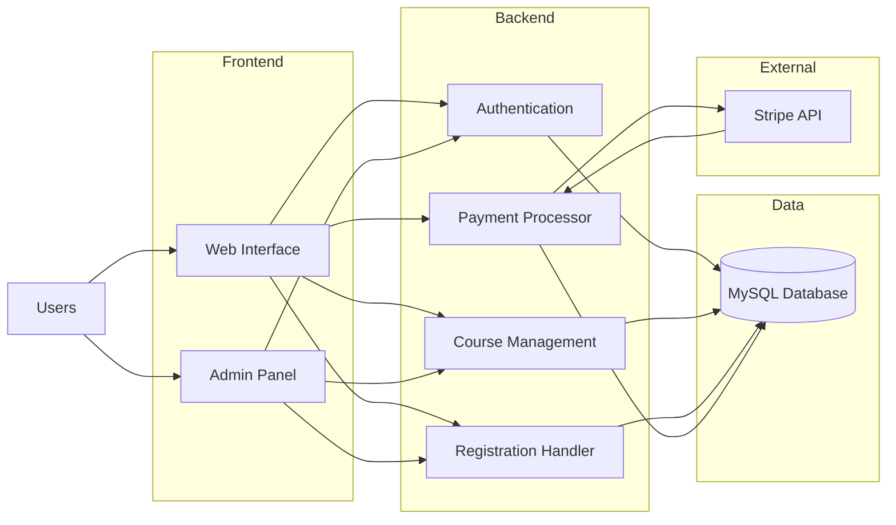
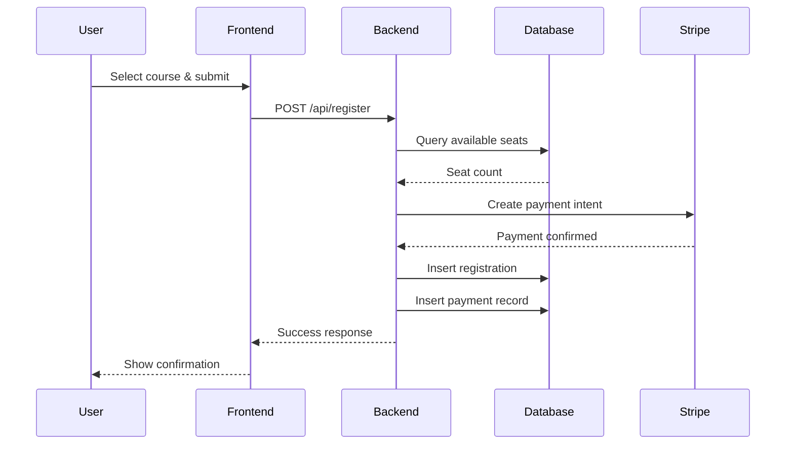
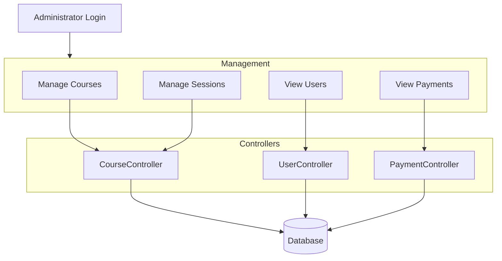

# System Architecture Documentation

## Project Overview

This document describes the architecture for a sports facility management application. The system handles course scheduling, user registrations, online payments, and administrative operations.

## Architecture Components

### Front-end Layer
- HTML/CSS for structure and styling
- Twig templating engine integrated with Symfony
- Responsive user interface for course browsing and registration
- Administrative dashboard for facility management

### Back-end Layer
- PHP with Symfony framework
- MVC architecture pattern
- RESTful API endpoints
- Business logic processing
- Authentication and authorization handling

### Data Layer
- MySQL relational database
- Doctrine ORM for database abstraction
- Entity relationships for users, courses, sessions, and payments

### External Services
- Stripe payment gateway integration
- Webhook(notify when an event occurs) handling for payment confirmations

## Technology Stack

**Frontend**: HTML, CSS, Twig
**Backend**: PHP, Symfony
**Database**: MySQL
**Payments**: Stripe API

## System Architecture Diagram

## Data Flow Process

Registration and payment workflow:

1. User selects a course from the schedule
2. Form submission triggers frontend validation
3. HTTP POST request sent to backend API
4. Backend checks session availability in database
5. If seats available, payment request sent to Stripe
6. Stripe processes payment and returns status
7. Backend updates database with registration and payment records
8. Success response returned to frontend
9. User receives confirmation message

## Database Structure

**users**
- id
- email
- password
- role
- created_at
- updated_at

**courses**
- id
- name
- description
- category
- duration
- instructor

**sessions**
- id
- course_id
- start_time
- end_time
- max_seats
- available_seats

**registrations**
- id
- user_id
- session_id
- status
- created_at
- cancelled_at

**payments**
- id
- user_id
- amount
- stripe_payment_id
- status
- created_at

**session_books**
- id
- user_id
- sessions_count
- remaining_sessions
- purchase_date
- expiry_date

## Backend Services

### Authentication Service
Handles user login, registration, and role-based access control. Uses Symfony Security component with password hashing.

### Course Management Service
CRUD operations for courses and sessions. Manages scheduling, capacity limits, and instructor assignments.

### Registration Service
Processes user registrations, validates seat availability, handles cancellations, and maintains waitlists.

### Payment Service
Integrates with Stripe API for payment processing. Manages transactions, refunds, and session book purchases.

## Administrator Workflow

Administrative capabilities include:
- Course creation and modification
- Session scheduling and capacity management
- User account oversight
- Payment and transaction review
- Report generation

## Scalability Considerations

The architecture supports growth through:
- Modular service design allows independent scaling
- Database indexing on frequently queried columns
- Stateless API design enables horizontal scaling
- Caching layer can be added for performance
- Symfony's built-in optimization tools

## Security Measures

- Password encryption using bcrypt
- CSRF token validation on forms
- Role-based access control
- Secure payment handling via Stripe
- Input validation and sanitization
- SQL injection prevention through Doctrine ORM

## Future Development

Planned enhancements:
- Email notification system
- Mobile application
- Advanced reporting dashboard
- Multi-language support
- Waiting list automation